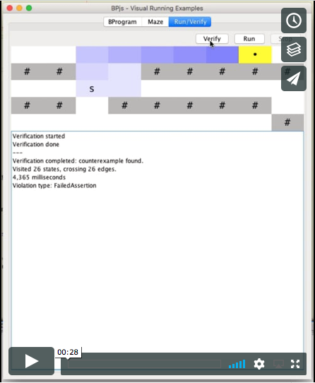
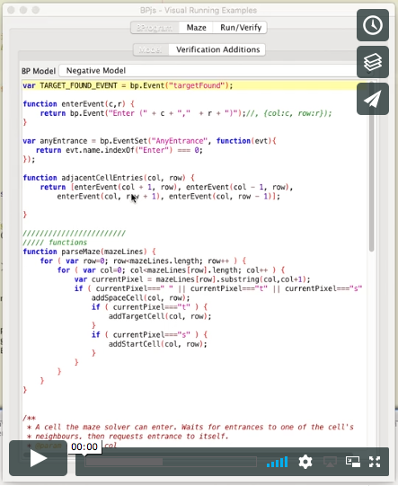

ifndef::env-github[:icons: font]
ifdef::env-github[]
:status:
:outfilesuffix: .adoc
:caution-caption: :fire:
:important-caption: :exclamation:
:note-caption: :page_with_curl:
:tip-caption: :bulb:
:warning-caption: :warning:
endif::[]
== GUI MazeRunner

[NOTE]
The code in this repository captures the state of the application when it was used to generate figures for the paper. The main repository of this project, which may have evolved since the paper has been submitted, is available link:https://github.com/bThink-BGU/VisualRunningExamples[here].

This project contains sample b-programs whose execution and verification
can be examined visually.

Currently, it provides a ``playground'' for running and verifying maze
models.

This program may also serve as an example of using BPjs in a ``normal''
application.

=== Running from the commandline:

Preconditions::
    You'll need Java and link:https://maven.apache.org[Apache Maven].

Running::
    1. With your terminal app, navigate to the project's directory
    2. Type `mvn exec:java`

=== Screencaps

Running maze simulation:

https://vimeo.com/284430892[]

Finding maze solution using verification:

https://vimeo.com/284431112[]

'''''

[NOTE]
* This project uses https://github.com/bThink-BGU/BPjs[BPjs].
* BPjs uses the Mozilla Rhino Javascript engine. See
https://developer.mozilla.org/en-US/docs/Mozilla/Projects/Rhino[here]
for project page and source code.
* Syntax coloring done using
https://github.com/bobbylight/RSyntaxTextArea[RSyntaxTextArea]
* The application UI is done using the standard Java Swing library.
