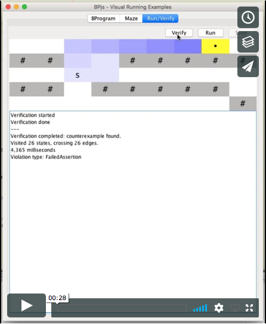
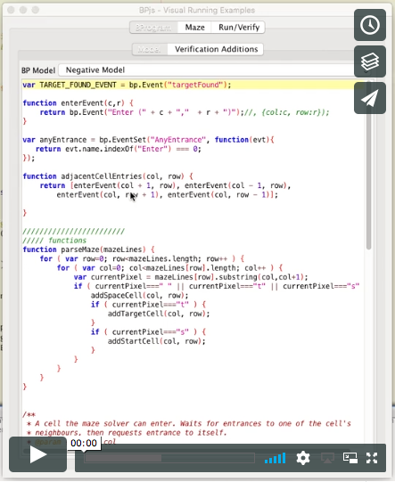

# GUI MazeRunner

> **NOTE**
> 
> The code in this repository captures the state of the application when it was used to generate figures for the paper. The main repository of this project, which may have evolved since the paper has been submitted, is available here: https://github.com/bThink-BGU/VisualRunningExamples.

This project contains sample b-programs whose execution and verification
can be examined visually.

Currently, it provides a ``playground'' for running and verifying maze
models.

This program may also serve as an example of using BPjs in a mainstream, OO-based application.

## Running from the commandline:

* Preconditions:
    You'll need Java and [Apache Maven](https://maven.apache.org).

* Running:
    1. With your terminal app, navigate to the project's directory
    2. Type `mvn exec:java`

## Screencaps

Running maze simulation:

Finding maze solution using verification:

* This project uses [BPjs](https://github.com/bThink-BGU/BPjs).
* BPjs uses the Mozilla Rhino Javascript engine. See [here](https://developer.mozilla.org/en-US/docs/Mozilla/Projects/Rhino) for project page and source code.
* Syntax coloring done using [RSyntaxTextArea](https://github.com/bobbylight/RSyntaxTextArea).
* The application UI is done using the standard Java Swing library.
